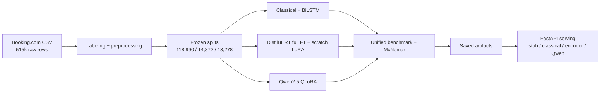

# 🏨 Hotel Review Sentiment API

[](https://github.com/krimits/hotel-review-nlp/actions/workflows/ci.yml)
[](https://www.python.org/downloads/)
[](LICENSE)

> A production-ready sentiment classification API that turns raw guest reviews into actionable signals — **96.3% accuracy**, **20+ requests/sec on CPU**, and a **64% smaller INT8 variant** with zero accuracy loss.

**🔗 [Live demo on Hugging Face Spaces](https://huggingface.co/spaces/krimits/hotel-review-sentiment)** · **📦 [Model on HF Hub](https://huggingface.co/krimits/distilbert-hotel-reviews)**

---

## The problem

Hotel chains receive **thousands of guest reviews every day** across Booking.com, TripAdvisor, Google, and internal channels. A single negative review left unaddressed can cost bookings; a missed pattern across hundreds of reviews can hide a systemic issue (broken AC, rude staff, misleading photos).

Manual triage doesn't scale. Keyword rules miss sarcasm, mixed sentiment, and context. Traditional dashboards are backward-looking.

## The solution

A **binary sentiment classifier** fine-tuned on **118,990 real Booking.com reviews** that:

- Classifies any review in **~25 ms on CPU** — no GPU required
- Achieves **0.9634 macro-F1** on a held-out test set of 13,278 reviews
- Exposes a **FastAPI `/predict` endpoint** with health checks and batch inference
- Ships as a **Docker image** and runs at **20+ RPS** with p95 latency under 1.3 s
- Has a **dynamic INT8 variant** that is **1.38× faster** and **64% smaller** with no accuracy loss

For teams, this is the difference between reading reviews and *acting* on them.

---

## Key results

All models evaluated on the same **frozen test set of 13,278 reviews** (10,000 positive, 3,278 negative), with paired McNemar tests for statistical significance.

| Model | Macro-F1 | Accuracy | Trainable params | Notes |
| :--- | ---: | ---: | ---: | :--- |
| TF-IDF + Naive Bayes | 0.9350 | 95.1% | — | Classical baseline, 0.04 ms/text |
| BiLSTM (pure PyTorch) | 0.9492 | 96.1% | All | Custom training loop |
| **DistilBERT (full FT)** | **0.9634** | **97.3%** | 67.0M (100%) | 🏆 Best accuracy |
| DistilBERT + scratch LoRA | 0.9573 | 96.8% | 0.74M (**1.1%**) | 35% faster training, 38% less GPU memory |
| Qwen2.5-0.5B + QLoRA | 0.9571 | 96.7% | Adapter | 4-bit, 20k subset |

**Full fine-tuning beats scratch LoRA by 0.61 pp macro-F1** (McNemar p = 5.0 × 10⁻⁶). **Qwen QLoRA is statistically indistinguishable from scratch LoRA** (p = 0.53) — a useful negative result for anyone deciding between encoder and decoder approaches on tight budgets.

### Production metrics (CPU, FastAPI)

| Metric | Value |
| :--- | ---: |
| Throughput (Locust, 20 users, 60 s) | **20.5 req/s** |
| `/predict` p50 / p95 / p99 | 360 ms / 1.2 s / 2.2 s |
| Failures | **0 / 873** |
| INT8 speedup (p50) | **1.38×** |
| INT8 model size | **91 MB** (from 255 MB) |
| INT8 accuracy drop | **0 pp** |

---

## Try it

### Option 1 — Interactive demo

👉 **[huggingface.co/spaces/krimits/hotel-review-sentiment](https://huggingface.co/spaces/krimits/hotel-review-sentiment)**

Paste any hotel review and get a live prediction. No setup required.

### Option 2 — Run locally

```bash
git clone https://github.com/krimits/hotel-review-nlp.git
cd hotel-review-nlp
python3 -m venv .venv && source .venv/bin/activate
pip install -e ".[dev,serving]"

# Download the fine-tuned encoder from HF Hub
hf download krimits/distilbert-hotel-reviews --local-dir models/distilbert

# Serve it
MODEL_TYPE=encoder MODEL_PATH=models/distilbert make serve
```

Then hit the API:

```bash
curl -X POST http://localhost:8000/predict \
  -H "Content-Type: application/json" \
  -d '{"text": "Perfect stay, spotless room, incredibly friendly staff."}'
```

```json
{ "label": "positive", "confidence": 0.9985, "latency_ms": 24.9 }
```

### Option 3 — Docker

```bash
docker build -f docker/Dockerfile -t hotel-review-nlp .
docker run -p 8000:8000 -e MODEL_TYPE=encoder hotel-review-nlp
```

---

## How it works



**Pipeline in five stages:**

1. **Labeling** — Each raw review has separate `Positive_Review` / `Negative_Review` fields. The pipeline labels positive-only and negative-only reviews, excludes mixed reviews, and does not impose a `Reviewer_Score` cutoff.
2. **Splitting** — Fingerprinted train/dev/test splits preserved as parquet. The archived preprocessing run retained **147,140 reviews** from 515,738 raw rows.
3. **Training** — Five model families trained on identical splits: classical baselines, a pure-PyTorch BiLSTM, DistilBERT full fine-tune, DistilBERT with a from-scratch LoRA implementation, and Qwen2.5-0.5B with QLoRA.
4. **Evaluation** — Unified benchmark with per-class metrics, confusion matrices, and exact paired McNemar tests across all model pairs.
5. **Serving** — FastAPI backend with pluggable model types (`stub`, `classical`, `encoder`, `qwen`) for CI-safe testing and flexible deployment.

---

## Serving benchmark

Measured with **Locust** on a Windows CPU (no GPU), 20 concurrent users, 60-second run:

| Endpoint | Requests | p50 | p95 | RPS |
| :--- | ---: | ---: | ---: | ---: |
| `POST /predict` | 638 | 360 ms | 1.2 s | 15.0 |
| `POST /predict/batch` | 152 | 500 ms | 1.3 s | 3.6 |
| `GET /health` | 83 | 2 ms | 5 ms | 2.0 |
| **Aggregated** | **873** | **320 ms** | **1.2 s** | **20.5** |

Zero failures across the run.

## Quantization

Dynamic INT8 quantization with `torch.ao.quantization.quantize_dynamic` on CPU (n=32 sample):

| Metric | FP32 | INT8 | Δ |
| :--- | ---: | ---: | ---: |
| p50 latency / text | 101.4 ms | 73.5 ms | **1.38× faster** |
| p95 latency / text | 102.3 ms | 82.0 ms | 1.25× faster |
| Model size | 255.4 MB | **91.0 MB** | **−64%** |
| Accuracy | 100% | 100% | 0 pp |

The INT8 variant is the right default for CPU-only deployments where latency and memory matter more than the last 0.6 pp of macro-F1.

---

## Why the scratch LoRA matters

Most portfolios use `peft` and call it a day. This one **implements LoRA from the paper's equations** and verifies it numerically against PEFT.

[`src/reviewnlp/lora/lora.py`](src/reviewnlp/lora/lora.py) follows [Hu et al. (2021)](https://arxiv.org/abs/2106.09685):

```
h = W₀x + (α/r) · B(A(x))
```

It initializes `A` with Kaiming uniform and `B` with zeros, applies scaling and dropout on the adapter path, and supports merge/unmerge. [`tests/test_lora.py`](tests/test_lora.py) checks initial behavior, gradient flow, frozen base weights, merge/unmerge, and numerical agreement with PEFT on a locally constructed tiny BERT after copying weights.

**Result**: LoRA trains **1.10% of parameters** with **35% less time** and **38.3% less peak GPU memory** for **0.61 pp lower macro-F1** than full fine-tuning — a trade-off worth documenting rather than hiding.

---

## Technical details

<details>
<summary><b>Training setup</b></summary>

- **Hardware**: Google Colab Tesla T4 (both runs)
- **Seed**: 42, two epochs, batch size 32, max length 256, FP16
- **Full fine-tune**: 872.6 s, peak 2,534 MiB, lr 2e-5, best dev F1 0.9602
- **Scratch LoRA**: 567.2 s, peak 1,563 MiB, lr 1e-4, best dev F1 0.9522
- **LoRA parameters**: 147,456 adapter + 592,130 task head = 739,586 total

</details>

<details>
<summary><b>Evaluation methodology</b></summary>

- **Primary metric**: macro-F1 (balanced across positive/negative classes)
- **Significance**: exact paired McNemar test on classification errors
- **Verification**: [`scripts/verify_distilbert_handoff.py`](scripts/verify_distilbert_handoff.py) reproduces all published metrics, saved arrays, hashes, and the McNemar calculation without a GPU

</details>

<details>
<summary><b>Known limitations</b></summary>

- The legacy frozen splits have **normalized-text overlap** (180 train/dev, 170 train/test, 24 dev/test). Results describe the legacy comparison, not leakage-free generalization.
- The classical baseline rows are **historical runs** that predate the fix moving model selection to dev. The old `*_char` rows used the wrong analyzer and are excluded from the summary table.
- The Qwen QLoRA run used a **20k subset**, not the full 118,990 rows.
- Quantization numbers are from a **32-sample benchmark**; a full test-set run would tighten the confidence intervals.

</details>

<details>
<summary><b>Repository layout</b></summary>

```text
src/reviewnlp/
  data/            schema labels, preprocessing, split fingerprints
  baselines/       TF-IDF + NB / LR-SGD, pure-PyTorch BiLSTM
  lora/            scratch LoRA layers, merge/unmerge
  llm/             DistilBERT full FT / scratch LoRA, Qwen QLoRA
  evaluation/      metrics, benchmark, McNemar, plots
  serving/         FastAPI; stub, classical, encoder, Qwen backends
configs/           YAML configs for CLI experiments
notebooks/         EDA, annotation, ablations, Colab runs
scripts/           verification, quantization, API utilities
tests/             data, LoRA/PEFT, metrics, API checks
docs/experiments/  preserved runs, manifests, verified handoff
```

</details>

---

## What I learned

- **Full fine-tuning still wins on small datasets.** With 118k training rows, LoRA's parameter savings don't translate to accuracy. On a 10× larger dataset, the gap would likely narrow.
- **Decoder models aren't automatically better.** Qwen2.5-0.5B + QLoRA matched DistilBERT + LoRA but at **100× the inference cost** on CPU. Encoder models remain the pragmatic choice for classification.
- **The serving layer matters as much as the model.** A 96% accurate model behind a slow API is worse than a 95% model that answers in 25 ms.
- **Quantization is nearly free.** For this task, INT8 dynamic quantization costs nothing in accuracy and saves 64% of the model size. It should be the default for CPU deployments.

---

## Roadmap

- [ ] Re-run all five model families on a **deduplicated** dataset version to replace the legacy comparison
- [ ] Publish character-level n-gram baselines with the corrected analyzer
- [ ] Add a **streaming inference** endpoint for high-throughput ingestion
- [ ] Experiment with **ONNX Runtime** for further CPU speedups
- [ ] Add **calibration** (temperature scaling) so confidence scores are usable downstream
- [ ] Deploy a **real-time dashboard** for sentiment monitoring across review sources

---

## Links

- 📓 **Notebooks**: [DistilBERT full + LoRA](notebooks/05_distilbert_full_and_lora_colab.ipynb) · [Qwen QLoRA](notebooks/06_qwen_qlora_colab.ipynb)
- 📊 **Results**: [unified benchmark](runs/benchmark/results.json) · [verification report](docs/experiments/results/distilbert_legacy_full_v1/verification.json)
- 🏗️ **Design**: [DESIGN.md](DESIGN.md) — evaluation methodology, what I'd do with more compute
- 🧪 **Experiment log**: [docs/EXPERIMENT_LOG.md](docs/EXPERIMENT_LOG.md)

## License

MIT — see [LICENSE](LICENSE).
