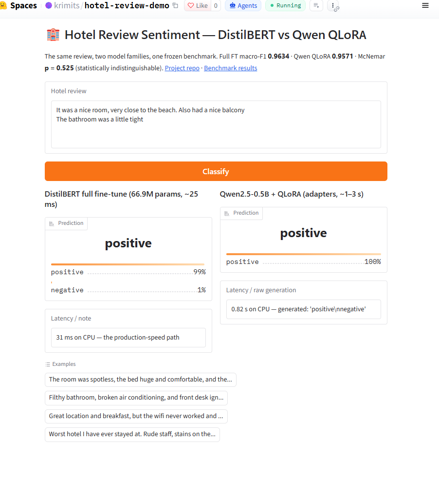
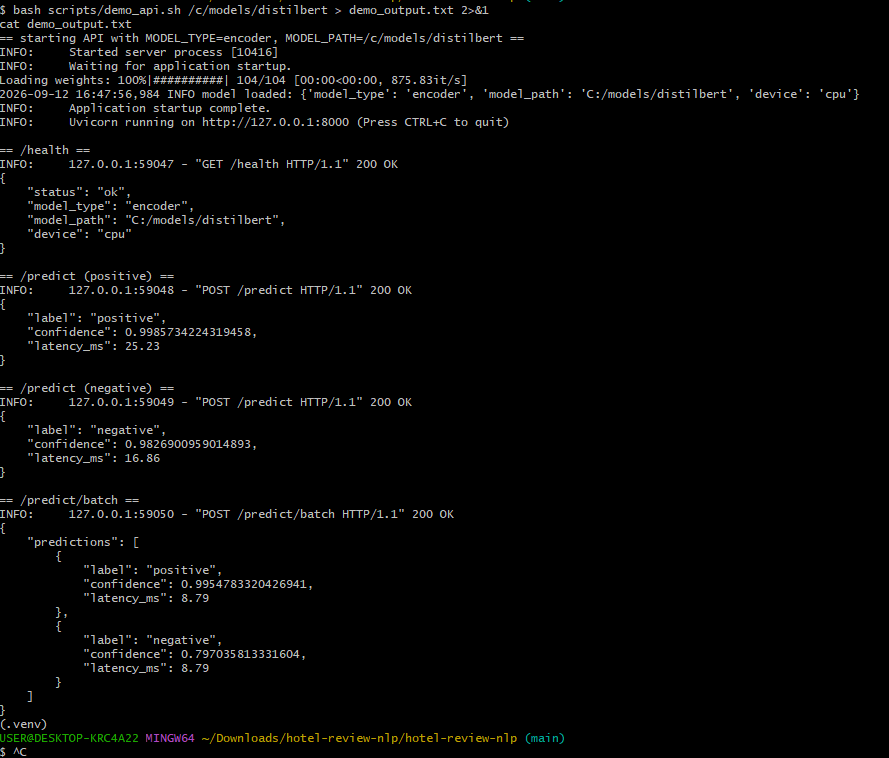
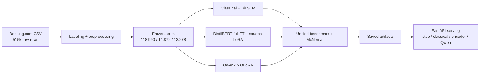

# 🏨 Hotel Review Sentiment API

[](https://github.com/krimits/hotel-review-nlp/actions/workflows/ci.yml)
[](https://www.python.org/downloads/)
[](LICENSE)

> Hotel review classification and an emerging hotel-operations product: **0.9634 macro-F1 / 97.27% accuracy** on a historical test split, with an API, aspect extraction and hotel-scoped recommendations. The historical split contains known text overlap; see [limitations](#technical-details).

 **[hotel-review-demo](https://huggingface.co/spaces/krimits/hotel-review-demo)**  · **[greek-review-sentiment-demo](https://huggingface.co/spaces/krimits/greek-review-sentiment-demo)** .**📦 [Model on HF Hub](https://huggingface.co/krimits/distilbert-hotel-reviews)**

---

## The problem

Hotel chains receive **thousands of guest reviews every day** across Booking.com, TripAdvisor, Google, and internal channels. A single negative review left unaddressed can cost bookings; a missed pattern across hundreds of reviews can hide a systemic issue (broken AC, rude staff, misleading photos).

Manual triage doesn't scale. Keyword rules miss sarcasm, mixed sentiment, and context. Traditional dashboards are backward-looking.

## The solution

A **binary sentiment classifier** fine-tuned on **118,990 real Booking.com reviews** that:

- Supports CPU inference; the archived FastAPI load test measured `/predict` p50 **360 ms under load** on its Windows CPU
- Achieves **0.9634 macro-F1** on a held-out test set of 13,278 reviews
- Exposes a **FastAPI service** — `/predict` for scoring, `/absa` for per-aspect extraction — with health checks and batch paths for both
- Ships as a Docker image and includes an optional [hotel operations dashboard](docs/PRODUCT_SETUP.md)
- Includes a reproducible dynamic INT8 benchmark script; its earlier 32-review measurements need a fresh full-test run

For teams, this is the difference between reading reviews and *acting* on them.

---

## Key results

All models evaluated on the same **frozen test set of 13,278 reviews** (10,000 positive, 3,278 negative), with paired McNemar tests for statistical significance. Every row is the number recorded in the preserved run artifacts under [`docs/experiments/results/`](docs/experiments/results/) — the DistilBERT pair is additionally recomputed from saved logits by [`scripts/verify_distilbert_handoff.py`](scripts/verify_distilbert_handoff.py) on every CI run.

| Model | Macro-F1 | Accuracy | Trainable params | Notes |
| :--- | ---: | ---: | ---: | :--- |
| TF-IDF + Naive Bayes | 0.9345 | 95.09% | — | Classical baseline, 0.04 ms/text |
| BiLSTM (pure PyTorch) | 0.9503 | 96.29% | All | Custom training loop, seed 42 |
| **DistilBERT (full FT)** | **0.9634** | **97.3%** | 67.0M (100%) | 🏆 Best accuracy |
| DistilBERT + scratch LoRA | 0.9573 | 96.8% | 0.74M (**1.1%**) | 35% faster training, 38% less GPU memory |
| Qwen2.5-0.5B + QLoRA | 0.9571 | 96.7% | Adapter | 4-bit, 20k subset |

**Fresh clean-split result (separate experiment):** the newly uploaded processed
parquets were audited, cleaned and kept separate from the legacy comparison.
On their derived **13,270-review** test set, a word TF-IDF + Naive Bayes model
selected on dev reached **0.9347 macro-F1** and **95.10% accuracy**. Its
fingerprints, rejected duplicates, per-class metrics and explicit missing-model
list are in [the new benchmark](runs/benchmark/README.md), the
[four candidate metrics](docs/experiments/results/classical_clean_uploaded_metrics.json) and
[`results.json`](runs/benchmark/results.json). The raw Booking CSV was not
available for an end-to-end rebuild; old and new scores use different tests.

<details>
<summary><b>Pairwise McNemar tests (exact, on classification errors)</b></summary>

| Pair | Discordant | p-value | Significant at 0.05 |
| :--- | ---: | ---: | :---: |
| Classical vs BiLSTM | 542 | 9.4 × 10⁻⁹ | ✅ |
| Classical vs DistilBERT full | 506 | 2.3 × 10⁻³⁸ | ✅ |
| Classical vs DistilBERT LoRA | 510 | 2.5 × 10⁻²³ | ✅ |
| Classical vs Qwen QLoRA | 544 | 1.1 × 10⁻¹⁹ | ✅ |
| BiLSTM vs DistilBERT full | 366 | 2.8 × 10⁻¹⁵ | ✅ |
| BiLSTM vs DistilBERT LoRA | 374 | 6.2 × 10⁻⁶ | ✅ |
| BiLSTM vs Qwen QLoRA | 380 | 1.1 × 10⁻⁴ | ✅ |
| DistilBERT full vs LoRA | 182 | 5.0 × 10⁻⁶ | ✅ |
| DistilBERT full vs Qwen | 320 | 4.2 × 10⁻⁵ | ✅ |
| **DistilBERT LoRA vs Qwen QLoRA** | **300** | **0.53** | ❌ |

**9 of 10 pairwise differences are statistically significant.** LoRA and QLoRA are indistinguishable on this task — 739K adapter parameters match a 0.5B LLM fine-tuned with 4-bit quantization.

</details>

**Full fine-tuning beats scratch LoRA by 0.61 pp macro-F1** (McNemar p = 5.0 × 10⁻⁶). **Qwen QLoRA is statistically indistinguishable from scratch LoRA** (p = 0.53) — a useful negative result for anyone deciding between encoder and decoder approaches on tight budgets.

### Archived API load test (CPU, FastAPI)

| Metric | Value |
| :--- | ---: |
| Mixed traffic: `/predict`, `/predict/batch`, `/health` (20 users, 60 s) | **20.5 req/s total** |
| `/predict` p50 / p95 / p99 | 360 ms / 1.2 s / 2.2 s |
| Failures | **0 / 873** |
| Old INT8 estimate | **1.38×** on a 32-review sample; new benchmark pending |

---

## Try it

### Option 1 — Interactive demo

👉 Try the deployed models interactively:

- **[hotel-review-demo](https://huggingface.co/spaces/krimits/hotel-review-demo)** —
  DistilBERT (25 ms) vs Qwen2.5-0.5B QLoRA (~1–3 s) vs GreekBERT (86 ms), three tabs
  on one review text.
- **[greek-review-sentiment-demo](https://huggingface.co/spaces/krimits/greek-review-sentiment-demo)** —
  dedicated Greek-language demo (GreekBERT, single tab).
  
Paste any hotel review and get a live prediction. No setup required.



### Option 2 — Run locally

```bash
git clone https://github.com/krimits/hotel-review-nlp.git
cd hotel-review-nlp
python3 -m venv .venv && source .venv/bin/activate
pip install -e ".[dev,serving]"

# Download the fine-tuned encoder from HF Hub
hf download krimits/distilbert-hotel-reviews --local-dir models/distilbert

# Serve it
MODEL_TYPE=encoder MODEL_PATH=models/distilbert make serve
```

Then hit the API:

```bash
curl -X POST http://localhost:8000/predict \
  -H "Content-Type: application/json" \
  -d '{"text": "Perfect stay, spotless room, incredibly friendly staff."}'
```

```json
{ "label": "positive", "confidence": 0.9985, "latency_ms": 24.9 }
```

`bash scripts/demo_api.sh` exercises `/health`, both `/predict` paths and `/predict/batch` against a
real encoder checkpoint:



### Option 3 — Docker

```bash
docker build -f docker/Dockerfile -t hotel-review-nlp .

# Smoke-test the API contract with no weights at all
docker run -p 8000:8000 -e MODEL_TYPE=stub hotel-review-nlp
```

Weights are **never baked into the image** — mount them and point `MODEL_PATH` at the
mount, or the container exits at startup:

```bash
hf download krimits/distilbert-hotel-reviews --local-dir models/distilbert

docker run -p 8000:8000 \
  -v "$(pwd)/models:/models:ro" \
  -e MODEL_TYPE=encoder -e MODEL_PATH=/models/distilbert \
  hotel-review-nlp
```

`MODEL_TYPE` accepts `stub`, `classical`, `encoder` or `qwen_qlora`; everything except
`stub` requires `MODEL_PATH`.

---

## API endpoints

| Method | Path | What it does |
|---|---|---|
| `GET` | `/health` | Liveness plus the loaded model's info |
| `POST` | `/predict` | One review → label, confidence, latency |
| `POST` | `/predict/batch` | Up to 256 reviews |
| `POST` | `/absa` | One review → aspects, sentiments, supporting quotes |
| `POST` | `/absa/batch` | Up to 256 reviews, one padded forward pass per batch |
| `GET` | `/hotels/{hotel_id}/recommendations` | Stored aspects for a hotel, worst first |
| `DELETE` | `/hotels/{hotel_id}/reviews/{review_id}` | Delete a stored review and its extracted quotes |
| `POST` | `/greek/predict`, `/greek/predict/batch` | Greek sentiment (requires `GREEK_MODEL_PATH`; trained on tweets) |
| `GET` | `/dashboard` | Hotel operations view over stored review aspects |

Interactive docs are at `/docs` once the service is running.

To enable hotel-scoped storage and API-key authorization, set `REVIEWNLP_DB_PATH`
and `REVIEWNLP_API_KEYS_JSON` before starting the server. The dashboard does
not keep your key in browser storage. See [the product setup guide](docs/PRODUCT_SETUP.md)
for a complete local walkthrough. The API without a configured store is a
demo: it will not claim to have calculated real hotel recommendations.

The `/absa` paths load `Qwen2.5-0.5B-Instruct` on first use and keep it for the
process, so the first request pays for the load and the rest do not. Configure
with `ABSA_ADAPTER_DIR` (omit for the base model, which is what the prototype
uses), `ABSA_DEVICE` and `ABSA_BATCH_SIZE`.

<details>
<summary><b>POST /absa</b> — aspects from one review</summary>

```bash
curl -X POST http://localhost:8000/absa \
  -H "Content-Type: application/json" \
  -d '{"hotel_id": "acme-athens", "review_id": "r-1042",
       "text": "The room was fine but it was very loud all night."}'
```

```json
{
  "hotel_id": "acme-athens",
  "review_id": "r-1042",
  "stored": false,
  "aspects": [
    {"aspect": "noise", "sentiment": "negative", "quote": "very loud", "confidence": null}
  ],
  "overall_sentiment": "negative",
  "json_valid": true,
  "salvaged": false,
  "entries_dropped": 0,
  "quote_absent": 0,
  "quote_not_in_review": 0,
  "generation_hit_token_budget": false,
  "processing_time_ms": 39.82
}
```

`overall_sentiment` is `null` for a genuinely mixed review rather than a coin
flip — see the abstention note in the ABSA section. `json_valid`, `salvaged`
and `entries_dropped` describe how well the model followed the JSON
instruction, so a caller can tell a clean extraction from a salvaged one.

</details>

<details>
<summary><b>POST /absa/batch</b> — many reviews in one forward pass</summary>

```json
{
  "hotel_id": "acme-athens",
  "results": [
    {
      "hotel_id": "acme-athens",
      "review_id": "r-1",
      "stored": false,
      "aspects": [
        {"aspect": "staff", "sentiment": "positive", "quote": "kind staff", "confidence": null}
      ],
      "overall_sentiment": "positive",
      "json_valid": true,
      "salvaged": false,
      "entries_dropped": 0,
      "quote_absent": 0,
      "quote_not_in_review": 0,
      "generation_hit_token_budget": false,
      "processing_time_ms": null
    }
  ],
  "total_processing_time_ms": 0.69
}
```

Per-review `processing_time_ms` is **`null` in a batch**, on purpose. The
reviews are generated together in one padded pass, so no per-review share of
that time was measured; `total_processing_time_ms` is the figure that was.
A single `/absa` call is generated on its own, so there it is a real number.

</details>

<details>
<summary><b>GET /hotels/{hotel_id}/recommendations</b> — aspects worth acting on</summary>

Every figure is computed from stored aspect rows for that hotel and window.
With `REVIEWNLP_DB_PATH` configured, it returns actual complaints sorted by
priority and isolates hotels by API key. Without a configured store it
answers **501** rather than serving examples:

```json
{
  "detail": "No aspect store is configured. Set REVIEWNLP_DB_PATH to enable hotel-scoped persistence and recommendations; no example figures are returned."
}
```

The priority score is a heuristic, not an estimate of business impact.
Positive-only topics are excluded from the complaint list. An empty store
returns `200` with an empty list.

</details>

> The millisecond figures above come from the offline test harness, which drives
> the endpoints with a fake model. They show the response shape, not latency.
> `/predict` has benchmarked numbers in [Serving benchmark](#serving-benchmark);
> ABSA does not.

---

## How it works



**Pipeline in five stages:**

1. **Labeling** — Each raw review has separate `Positive_Review` / `Negative_Review` fields. The pipeline labels positive-only and negative-only reviews, excludes mixed reviews, and does not impose a `Reviewer_Score` cutoff.
2. **Splitting** — Fingerprinted train/dev/test splits preserved as parquet. The archived preprocessing run retained **147,140 reviews** from 515,738 raw rows.
3. **Training** — Five model families trained on identical splits: classical baselines, a pure-PyTorch BiLSTM, DistilBERT full fine-tune, DistilBERT with a from-scratch LoRA implementation, and Qwen2.5-0.5B with QLoRA.
4. **Evaluation** — Unified benchmark with per-class metrics, confusion matrices, and exact paired McNemar tests across all model pairs.
5. **Serving** — FastAPI backend with pluggable model types (`stub`, `classical`, `encoder`, `qwen`) for CI-safe testing and flexible deployment.

---

## Serving benchmark

Measured with **Locust** on a Windows CPU (no GPU), 20 concurrent users, 60-second run:

| Endpoint | Requests | p50 | p95 | RPS |
| :--- | ---: | ---: | ---: | ---: |
| `POST /predict` | 638 | 360 ms | 1.2 s | 15.0 |
| `POST /predict/batch` | 152 | 500 ms | 1.3 s | 3.6 |
| `GET /health` | 83 | 2 ms | 5 ms | 2.0 |
| **Aggregated** | **873** | **320 ms** | **1.2 s** | **20.5** |

Zero failures across the run.

---

## Quantization

The original CPU experiment used dynamic INT8 quantization on **32 reviews**:

| Metric | FP32 | INT8 | Δ |
| :--- | ---: | ---: | ---: |
| p50 latency / text | 101.4 ms | 73.5 ms | **1.38× faster** |
| p95 latency / text | 102.3 ms | 82.0 ms | 1.25× faster |
| Earlier size estimate | 255.4 MB | 91.0 MB | needs remeasurement |
| Accuracy | 100% | 100% | 0 pp |

Those values are historical, not a validated deployment guarantee: 32 reviews
cannot establish zero accuracy loss on the whole test set, and the original
size estimator counted parameters instead of serializing packed INT8 weights.
The corrected [`scripts/quantize_distilbert.py`](scripts/quantize_distilbert.py)
defaults to the full test set for accuracy, measures serialized state dicts,
and reports latency separately on an equal-size batch. No new full-test INT8
artifact is committed yet.

---

## Why the scratch LoRA matters

Most portfolios use `peft` and call it a day. This one **implements LoRA from the paper's equations** and verifies it numerically against PEFT.

[`src/reviewnlp/lora/lora.py`](src/reviewnlp/lora/lora.py) follows [Hu et al. (2021)](https://arxiv.org/abs/2106.09685):

```
h = W₀x + (α/r) · B(A(x))
```

It initializes `A` with Kaiming uniform and `B` with zeros, applies scaling and dropout on the adapter path, and supports merge/unmerge. [`tests/test_lora.py`](tests/test_lora.py) checks initial behavior, gradient flow, frozen base weights, merge/unmerge, and numerical agreement with PEFT on a locally constructed tiny BERT after copying weights.

**Result**: LoRA trains **1.10% of parameters** with **35% less time** and **38.3% less peak GPU memory** for **0.61 pp lower macro-F1** than full fine-tuning — a trade-off worth documenting rather than hiding.

---

## Aspect-based sentiment (prototype)

A binary label answers "was this review good?". A hotel manager needs "good at
what?" — *"the sheets were dirty, but the staff were wonderful and the view was
stunning"* is one `positive` that hides the only line worth acting on.

[`src/reviewnlp/absa/`](src/reviewnlp/absa/) extracts one record per aspect
instead:

```json
[
  {"aspect": "cleanliness", "sentiment": "negative", "quote": "sheets were dirty"},
  {"aspect": "staff",       "sentiment": "positive", "quote": "staff were wonderful"},
  {"aspect": "location",    "sentiment": "positive", "quote": "the view was stunning"}
]
```

The taxonomy is **fixed at eight aspects** (cleanliness, staff, location, room,
food, noise, value, facilities) rather than free-form, so that counts are
comparable from one week to the next. Unrecognized aspect strings are dropped
and counted, never coerced onto the nearest name — a coerced aspect invents
evidence for something the review never said.

**Two models, two roles.** Extraction runs on the **base**
`Qwen2.5-0.5B-Instruct`, zero-shot; the QLoRA adapter stays on binary scoring
where it was trained. The adapter was fine-tuned completion-only on
single-word targets, and asked for JSON it emits that trained single-word loop
instead — the instruction-following the task needs is what the fine-tune traded
away. `--variant base|adapter` keeps the comparison runnable rather than
asserted, and the failure mode itself is pinned in
[`tests/test_absa.py`](tests/test_absa.py).

```bash
# Per-aspect records + summary.json for a sample of the frozen test split
python scripts/run_absa.py --variant base \
    --test-parquet data/processed/test.parquet \
    --output-dir runs/absa_base
```

Every generation is parsed with quality flags: JSON recovered from surrounding
prose is flagged as `salvaged`, and aspects with missing or invented supporting
quotes are dropped. `scripts/prepare_absa_annotations.py` prepares a frozen
sample for independent human labeling; `scripts/evaluate_absa.py` scores aspect
detection and sentiment against completed annotations. No labeled evaluation
set or resulting performance figures have been published yet.

**Prototype status — what this section does not claim:**

- **No accuracy numbers are published here.** Runs land in git-ignored `runs/`,
  and no ABSA artifact is committed under `docs/experiments/`. As with the
  five-family benchmark above, the README publishes figures only once the
  artifact backing them is in the repository.
- **The overall vote abstains on genuinely mixed reviews.** One aspect positive
  and one negative returns no label rather than a coin flip. That is a declared
  behaviour, but it means any headline agreement score is bounded by how many
  reviews are mixed — a real open problem in ABSA, not a bug to tune away.
- **Zero-shot, with no supervised ABSA baseline** to compare against, and no
  gold aspect annotations — only the binary gold label the frozen split
  carries, which can check the aggregate vote but not the aspects themselves.
- **The generation loop is not covered offline.** `absa/pipeline.py` needs a
  model download, so CI exercises the taxonomy, parser, vote and runner helpers
  around it, not the batched `generate` call.

---

## Technical details

<details>
<summary><b>Training setup</b></summary>

- **Hardware**: Google Colab Tesla T4 (both runs)
- **Seed**: 42, two epochs, batch size 32, max length 256, FP16
- **Full fine-tune**: 872.6 s, peak 2,534 MiB, lr 2e-5, best dev F1 0.9602
- **Scratch LoRA**: 567.2 s, peak 1,563 MiB, lr 1e-4, best dev F1 0.9522
- **LoRA parameters**: 147,456 adapter + 592,130 task head = 739,586 total

</details>

<details>
<summary><b>Evaluation methodology</b></summary>

- **Primary metric**: macro-F1 (balanced across positive/negative classes)
- **Significance**: exact paired McNemar test on classification errors
- **Verification**: [`scripts/verify_distilbert_handoff.py`](scripts/verify_distilbert_handoff.py) reproduces all published metrics, saved arrays, hashes, and the McNemar calculation without a GPU

</details>

<details>
<summary><b>Known limitations</b></summary>

- The **historical training run** recorded normalized-text overlap (180 train/dev, 170 train/test, 24 dev/test). The newly uploaded three parquets were separately audited: they have **zero cross-split text overlap**, but 676 within-split duplicate rows and 19 train text groups with conflicting labels. The new clean baseline uses derived splits; the legacy five-model results do not become leakage-free by uploading later files.
- The classical baseline rows are **historical runs** that predate the fix moving model selection to dev. The old `*_char` rows used the wrong analyzer and are excluded from the summary table.
- The Qwen QLoRA run used a **20k subset**, not the full 118,990 rows.
- Quantization numbers are from a **32-sample benchmark**; a full test-set run would tighten the confidence intervals.
- The BiLSTM row is the **seed-42 run that has a saved metrics artifact**. Seed 100 reached a higher 0.9521 / 96.42% and a weighted-loss variant reached 0.9492 / 96.14% (see [`docs/EXPERIMENT_LOG.md`](docs/EXPERIMENT_LOG.md)), but neither has a preserved artifact bundle, so the table reports the reproducible one.
- The unified five-family **clean-split** comparison is **not published yet**: the historical McNemar table above is transcribed from the archived benchmark rather than regenerated from a committed artifact. The newly published `runs/benchmark/results.json` covers the clean classical baseline only; the legacy DistilBERT pair is independently machine-verified.
- The dashboard and SQLite store support a local single-worker pilot. ABSA aspect accuracy, Greek hotel-domain accuracy, access operations, and a real load test still need evidence before a public hosted product.

</details>

<details>
<summary><b>Repository layout</b></summary>

```text
src/reviewnlp/
  data/            schema labels, preprocessing, split fingerprints
  baselines/       TF-IDF + NB / LR-SGD, pure-PyTorch BiLSTM
  lora/            scratch LoRA layers, merge/unmerge
  llm/             DistilBERT full FT / scratch LoRA, Qwen QLoRA
  evaluation/      metrics, benchmark, McNemar, plots
  serving/         FastAPI; stub, classical, encoder, Qwen backends
  analytics/       SQLite aspect storage, complaint ranking and recommendations
  greek/           Greek fine-tune: config, splits, baseline, evaluation
  absa/            aspect taxonomy, strict JSON parser, per-aspect vote
configs/           YAML configs for CLI experiments
notebooks/         Colab templates (no saved outputs — see notebooks/README.md)
scripts/           verification, quantization, API utilities
tests/             data, LoRA/PEFT, metrics, API, Greek, ABSA checks
docs/experiments/  preserved runs, manifests, verified handoff
```

</details>

---

## What I learned

- **Full fine-tuning still wins on small datasets.** With 118k training rows, LoRA's parameter savings don't translate to accuracy. On a 10× larger dataset, the gap would likely narrow.
- **Decoder models aren't automatically better.** Qwen2.5-0.5B + QLoRA matched DistilBERT + LoRA but at **100× the inference cost** on CPU. Encoder models remain the pragmatic choice for classification.
- **The serving layer matters as much as the model.** A 96% accurate model behind a slow API is worse than a 95% model that answers in 25 ms.
- **Quantization deserves a full-test check.** A 32-example observation is a prompt for a larger, saved experiment, not a guarantee about accuracy or serialized model size.

---

## Roadmap

- [x] Audit the uploaded parquets and re-run the classical baseline, including character n-grams, on independently identified clean splits
- [ ] Re-run the remaining model families on those **same clean splits** to replace the historical comparison
- [ ] Add a **streaming inference** endpoint for high-throughput ingestion
- [ ] Experiment with **ONNX Runtime** for further CPU speedups
- [ ] Add **calibration** (temperature scaling) so confidence scores are usable downstream
- [x] Add a local hotel-scoped operations dashboard over stored aspect records
- [ ] Validate and deploy the dashboard with real hotel data and monitoring
- [ ] Publish independently annotated ABSA and Greek hotel evaluation sets and their measured results
- [ ] Replace the small-deployment SQLite store with an audited multi-worker storage and access-management setup before offering a public hosted service

---

## Links

- 📓 **Notebooks**: [executed runs with outputs](docs/experiments/notebooks/) · [Colab templates](notebooks/) ([what each needs](notebooks/README.md)) — the templates are committed without outputs and are meant to be run, not read as results
- 📊 **Results**: [preserved run artifacts](docs/experiments/results/) · [verification report](docs/experiments/results/distilbert_legacy_full_v1/verification.json)
- 🏗️ **Design**: [DESIGN.md](DESIGN.md) — evaluation methodology, what I'd do with more compute
- 🧪 **Experiment log**: [docs/EXPERIMENT_LOG.md](docs/EXPERIMENT_LOG.md)

## License

MIT — see [LICENSE](LICENSE).
