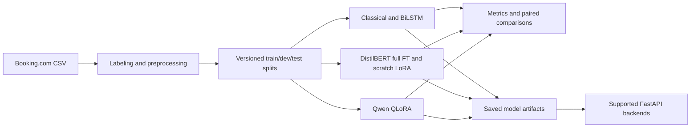

# Hotel Review NLP

[](https://github.com/krimits/hotel-review-nlp/actions/workflows/ci.yml)

End-to-end hotel-review sentiment classification: classical ML baselines, a pure-PyTorch BiLSTM, DistilBERT full fine-tuning, and **LoRA implemented from the paper's equations and checked numerically against PEFT**. The repository also includes Qwen QLoRA training, FastAPI serving, and a CPU INT8 evaluation script.

The main result: on the same 118,990 training reviews, scratch LoRA trains **1.10% of parameters**, with **35.0% less training time** and **38.3% less peak GPU memory**, for **0.61 percentage points lower test macro-F1** than full fine-tuning. Both runs used a Colab Tesla T4, and their saved predictions are included for independent verification.

## Results

The legacy frozen test set contains **13,278 reviews: 10,000 positive and 3,278 negative**. The two new DistilBERT runs select checkpoints on development macro-F1 and use identical ordered train/dev/test splits. This historical dataset has known normalized-text overlap between splits; a deduplicated benchmark remains to be run.

| Model | Training rows | Macro-F1 | Accuracy | Trainable parameters |
| :--- | ---: | ---: | ---: | :--- |
| TF-IDF word (1-2 grams) + Naive Bayes | 118,990 | 0.9345 | 95.09% | N/A |
| TF-IDF word (1-2 grams) + LR-SGD | 118,990 | 0.9173 | 94.11% | N/A |
| BiLSTM, pure PyTorch, seed 42 | 118,990 | 0.9503 | 96.29% | All weights |
| **DistilBERT full fine-tune** | 118,990 | **0.9634** | **97.27%** | 66,955,010 (100%) |
| **DistilBERT + scratch LoRA** | 118,990 | **0.9573** | **96.80%** | **739,586 (1.10%)** |
| Qwen2.5-0.5B QLoRA | 20,000 configured | Pending | Pending | Pending |
Throughput (Locust, 20 users, CPU): ~20.5 RPS
Latency p50 / p95 / p99 (single /predict): 360 ms / 1.2 s / 2.2 s
Failures: 0 / 873

Evidence: [classical metrics](docs/experiments/results/classical_legacy_metrics.json), [BiLSTM metrics](docs/experiments/results/bilstm_legacy_metrics.json), and the [verified DistilBERT comparison](docs/experiments/results/distilbert_legacy_full_v1/README.md). The classical rows are preserved historical runs, preceding the fix that moved classical model selection to dev. The old `*_char` rows used the wrong analyzer and require a rerun before publication as character n-gram baselines. The experiment log reports additional BiLSTM seeds, but their individual run artifacts are not included in this comparison.

| Full-data training on Tesla T4 | Full fine-tune | Scratch LoRA |
| :--- | ---: | ---: |
| Training time | 872.6 s (14.54 min) | 567.2 s (9.45 min) |
| Peak allocated GPU memory | 2,534.4 MiB | 1,563.0 MiB |
| Best dev macro-F1 | 0.9602 | 0.9522 |
| Learning rate | 2e-5 | 1e-4 |

Both runs used seed 42, two epochs, batch size 32, maximum length 256, and FP16. The LoRA parameter count includes 147,456 adapter parameters and 592,130 task-head parameters. Training time and memory are recorded run measurements, not inference benchmarks or averages across seeds.

Exact paired McNemar gives **p = 5.028 × 10⁻⁶**: full fine-tuning alone is correct on 122 reviews, while LoRA alone is correct on 60. This tests paired classification errors, rather than the macro-F1 difference itself. See the [recomputed verification report](docs/experiments/results/distilbert_legacy_full_v1/verification.json) and [methodology](DESIGN.md#5-evaluation-methodology).

## Labels from the schema

Each raw review has separate `Positive_Review` and `Negative_Review` fields. The dataset uses `No Positive` and `No Negative` markers for an absent sentiment field. The pipeline labels positive-only and negative-only reviews accordingly and excludes mixed reviews, without imposing a `Reviewer_Score` cutoff.

The archived preprocessing run retained **147,140 reviews** from 515,738 raw rows: **118,990 train / 14,872 dev / 13,278 test**. Its [split manifest](docs/experiments/legacy_dataset_manifest.json) fixes both file hashes and ordered text/label fingerprints. Normalized text overlaps number 180 for train/dev, 170 for train/test, and 24 for dev/test, so these results describe the legacy comparison rather than leakage-free generalization.

## Quickstart

Use Python 3.11. On Linux/macOS:

```bash
git clone https://github.com/krimits/hotel-review-nlp.git
cd hotel-review-nlp
python3 -m venv .venv
source .venv/bin/activate
python -m pip install -e ".[dev,serving]"
python -m pytest tests -v
```

On Windows PowerShell, after cloning and entering the repository:

```powershell
py -3.11 -m venv .venv
.\.venv\Scripts\python.exe -m pip install -e ".[dev,serving]"
.\.venv\Scripts\python.exe -m pytest tests -v
```

Verify the published DistilBERT metrics, saved arrays, hashes, and McNemar calculation without a GPU (use `.\.venv\Scripts\python.exe` for `python` on Windows):

```bash
python scripts/verify_distilbert_handoff.py
```

Add `--processed-dir data/processed` if you also have the archived legacy parquet files. This checks their exact fingerprints and verifies that saved labels match their row order. Raw reviews and parquet files are not committed.

### Colab training

- [05: DistilBERT full fine-tune and scratch LoRA](https://colab.research.google.com/github/krimits/hotel-review-nlp/blob/main/notebooks/05_distilbert_full_and_lora_colab.ipynb) produced the verified full-data results above.
- [06: Qwen QLoRA](https://colab.research.google.com/github/krimits/hotel-review-nlp/blob/main/notebooks/06_qwen_qlora_colab.ipynb) exports generation results, metrics, and an adapter bundle; its result is still pending.

Both notebooks accept the archived split ZIP or the three parquet files, verify fingerprints before training, and export results. They contain visible experiment settings and save the effective run configuration and provenance. The small DistilBERT handoff includes evaluation arrays; model weights and tokenizers are in the separate full bundle and are needed for serving or latency measurements.

### Local pipeline

With GNU Make and an activated environment, these targets expose the pipeline:

```bash
make data          # Build new splits from the Booking.com CSV
make baselines     # Train word/character baselines; select on dev
make bilstm        # Train the pure-PyTorch BiLSTM
make distilbert    # Full fine-tuning; requires GPU dependencies
make benchmark     # Evaluate available model artifacts
make docker        # Build the serving image; defaults to stub mode
```

See [data/raw/README.md](data/raw/README.md) for the raw dataset. **Current preprocessing includes deduplication and does not recreate the archived legacy splits.** Preserve the legacy files separately before generating a new dataset. The five-family `runs/benchmark/results.json` and live-inference latency results remain pending.

Serve an exported encoder checkpoint with:

```bash
MODEL_TYPE=encoder MODEL_PATH=runs/distilbert make serve
python scripts/quantize_distilbert.py --model runs/distilbert --dataset data/processed/test.parquet
```

These commands require the full model/tokenizer bundle and the relevant dependencies. Without `MODEL_TYPE`, serving uses the stub for API contract checks.

## Why the LoRA tests matter

[The scratch implementation](src/reviewnlp/lora/lora.py) uses torch only and follows [Hu et al. (2021)](https://arxiv.org/abs/2106.09685): `h = W0x + (alpha/r) * B(A(x))`. It initializes `A` with Kaiming uniform and `B` with zeros, applies scaling and dropout on the adapter path, and supports merge/unmerge.

[tests/test_lora.py](tests/test_lora.py) checks initial behavior, gradient flow, frozen base weights, merge/unmerge, and numerical agreement with PEFT on a locally constructed tiny BERT after copying weights. The equivalence result applies to the covered configuration. CI installs `transformers==4.56.2`, `peft==0.17.1`, and `accelerate==1.10.1` and runs lint, the full test suite, and archived-result verification. The PEFT test is optional in local environments that do not install PEFT.

## Architecture



```text
src/reviewnlp/
  data/            schema labels, preprocessing, split fingerprints
  baselines/       TF-IDF + NB / LR-SGD, pure-PyTorch BiLSTM
  lora/            scratch LoRA layers, merge/unmerge
  llm/             DistilBERT full FT / scratch LoRA, Qwen QLoRA
  evaluation/      metrics, benchmark, McNemar, plots
  serving/         FastAPI; stub, classical, encoder, Qwen backends
configs/           YAML configurations for CLI experiments
notebooks/         EDA, annotation, ablations, full-data Colab runs 05/06
scripts/           result verification, quantization, API utilities
tests/             data, LoRA/PEFT, metrics, and API checks
docs/experiments/  preserved runs, manifests, verified Colab handoff
docs/EXPERIMENT_LOG.md  historical experiment narrative
DESIGN.md          design decisions and evaluation methodology
```

## Remaining work

- Return and verify the Qwen QLoRA run from notebook 06.
- Re-run the corrected character baselines and collect individual BiLSTM seed artifacts.
- Publish the complete five-family benchmark, confusion matrices, and paired comparisons.
- Retrieve full model bundles and measure live-inference latency and INT8 quality/latency changes.
- Run all model families on one deduplicated dataset version to replace the legacy comparison.

The full-data DistilBERT/LoRA comparison is complete. Larger-model QLoRA, score-based three-class labels, calibration, and distillation are future extensions in [DESIGN.md §8](DESIGN.md#8-what-i-would-do-with-more-compute).

## License

MIT. See [LICENSE](LICENSE).
