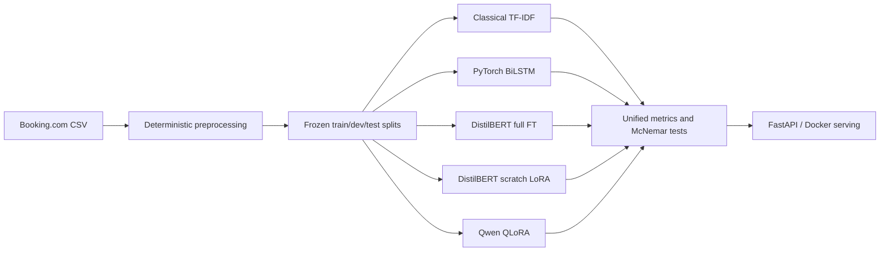

# Hotel Review NLP

[](https://github.com/krimits/hotel-review-nlp/actions/workflows/ci.yml)

An end-to-end sentiment-analysis project that compares classical NLP, a custom PyTorch BiLSTM, full DistilBERT fine-tuning, a from-scratch LoRA implementation, and Qwen2.5 QLoRA on one frozen hotel-review test set. The repository includes data preparation, statistically comparable evaluation, FastAPI serving, Docker support, and reproducible Colab runs.

## Current results

The rows below are backed by preserved local metrics on the frozen legacy test set (13,278 reviews). GPU rows remain explicitly pending until their model outputs, predictions, and metrics are returned from the new Colab notebooks.

| Model | Training rows | Macro-F1 | Accuracy | Evidence status |
|---|---:|---:|---:|---|
| TF-IDF word (1-2 grams) + MultinomialNB | 118,990 | 0.9345 | 0.9509 | Local pipeline and metrics preserved |
| Custom PyTorch BiLSTM | 118,990 | 0.9503 | 0.9629 | Local checkpoint and metrics preserved |
| DistilBERT full fine-tune | 118,990 | Pending | Pending | Run notebook 05 |
| DistilBERT + scratch LoRA | 118,990 | Pending | Pending | Run notebook 05 |
| Qwen2.5-0.5B-Instruct + QLoRA | 20,000 configured | Pending | Pending | Run notebook 06 |

Earlier 20k-review DistilBERT runs reported 0.9580 macro-F1 for full fine-tuning and 0.9486 for LoRA. They are retained in the [experiment log](docs/EXPERIMENT_LOG.md), but are not presented as final benchmark results because their complete artifacts are unavailable and their training set differs from the BiLSTM run.

## Quickstart

```bash
git clone https://github.com/krimits/hotel-review-nlp.git
cd hotel-review-nlp
python -m venv .venv
# Windows: .venv\Scripts\python -m pip install -e ".[dev,serving]"
# Linux/macOS: .venv/bin/python -m pip install -e ".[dev,serving]"
python -m pytest tests -v
```

Download the Booking.com 515K dataset as described in [data/raw/README.md](data/raw/README.md), then run:

```bash
python -m reviewnlp.data.preprocess --config configs/baselines.yaml
python -m reviewnlp.baselines.classical --config configs/baselines.yaml
python -m reviewnlp.baselines.bilstm --config configs/bilstm.yaml
python -m reviewnlp.evaluation.benchmark --config configs/baselines.yaml
```

GPU experiments are designed for Google Colab:

- [DistilBERT full fine-tune and scratch LoRA](notebooks/05_distilbert_full_and_lora_colab.ipynb) uses all 118,990 training rows for a fair comparison.
- [Qwen2.5 QLoRA](notebooks/06_qwen_qlora_colab.ipynb) trains the instruction model and exports test predictions for the shared benchmark.

Both notebooks verify the exact split fingerprints before training and export a ZIP containing metrics, predictions, configs, and model artifacts.

## Architecture



The code follows a `src/` package layout:

- `reviewnlp.data`: label construction, split generation, and dataset integrity
- `reviewnlp.baselines`: classical and custom BiLSTM training
- `reviewnlp.lora`: dependency-free LoRA layers, merge/unmerge, and parity tests
- `reviewnlp.llm`: DistilBERT and Qwen training/inference
- `reviewnlp.evaluation`: metrics, plots, and exact McNemar tests
- `reviewnlp.serving`: FastAPI inference service

## Reproducibility and evaluation

The legacy frozen split contains 118,990 train, 14,872 development, and 13,278 test rows. Every final model must use the same ordered test fingerprint:

```text
a02c21271639640d645d729b959ce666671d4ba4ed5abfd43e6f9b5729245730
```

Development data selects checkpoints and hyperparameters; test data is reserved for final scoring. The final benchmark will publish `runs/benchmark/results.json`, confusion matrices, latency measurements based on live inference, and exact paired McNemar p-values. Historical artifacts and investigation notes live under `docs/experiments/`.

## Design notes

Read [DESIGN.md](DESIGN.md) for the label rule, model-family rationale, LoRA implementation details, Colab memory budget, evaluation methodology, serving design, and reproducibility decisions. The evidence-backed completion audit is in [PROJECT_COMPLETION_AUDIT_2026-09-09.md](PROJECT_COMPLETION_AUDIT_2026-09-09.md).

## License

MIT, copyright Evgenios Krimitsas. See [LICENSE](LICENSE).
