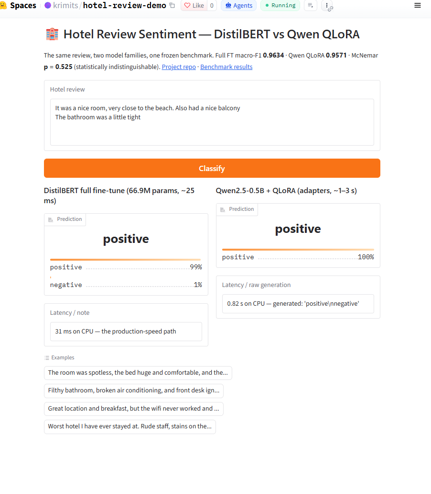
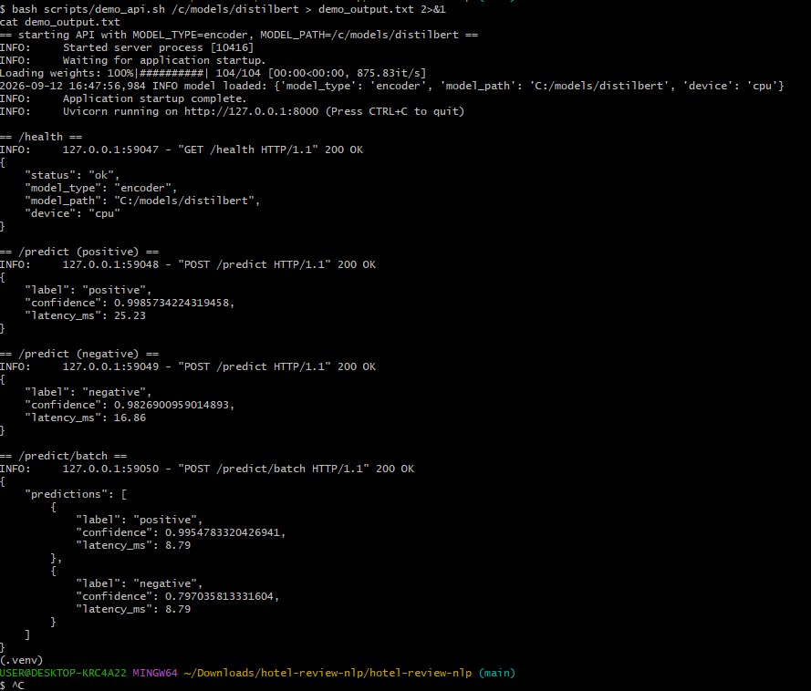
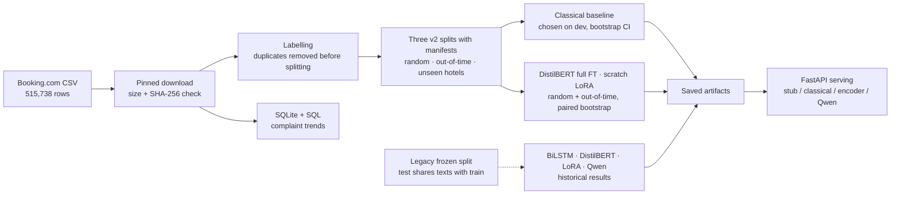

# 🏨 Hotel Review Sentiment API

[](https://github.com/krimits/hotel-review-nlp/actions/workflows/ci.yml)
[](https://www.python.org/downloads/)
[](LICENSE)

> Hotel review classification and an emerging hotel-operations product, with an API, aspect extraction and hotel-scoped recommendations. On test sets that share no review text with training, fine-tuned DistilBERT reaches **0.9642 macro-F1** on a random split and **0.9491** on reviews written after the training period. That is about 3 points above TF-IDF + Naive Bayes chosen on dev, a gain that meets a rule fixed before training ([decision note](docs/experiments/decision_distilbert_vs_nb.md)). Earlier figures, from a split whose test set shares 170 texts with training, are kept as [history](#historical-results-legacy-split-text-overlap). What this project demonstrates, with links to the evidence: [evidence map](docs/EVIDENCE_MAP.md).

 **[hotel-review-demo](https://huggingface.co/spaces/krimits/hotel-review-demo)**  · **[greek-review-sentiment-demo](https://huggingface.co/spaces/krimits/greek-review-sentiment-demo)** .**📦 [Model on HF Hub](https://huggingface.co/krimits/distilbert-hotel-reviews)**

---

## The problem

Hotel chains receive **thousands of guest reviews every day** across Booking.com, TripAdvisor, Google, and internal channels. A single negative review left unaddressed can cost bookings; a missed pattern across hundreds of reviews can hide a systemic issue (broken AC, rude staff, misleading photos).

Manual triage doesn't scale. Keyword rules miss sarcasm, mixed sentiment, and context. Traditional dashboards are backward-looking.

## The solution

A **binary sentiment classifier** trained on about **118,000 real Booking.com reviews** that:

- Supports CPU inference; the archived FastAPI load test measured `/predict` p50 **360 ms under load** on its Windows CPU
- Reaches **0.9642 macro-F1** with fine-tuned DistilBERT on a test set that shares no review text with training, and 0.9491 on reviews written after the training period; a TF-IDF + Naive Bayes baseline, 3 points lower, answers in about 1 ms on a CPU
- Exposes a **FastAPI service** — `/predict` for scoring, `/absa` for per-aspect extraction — with health checks and batch paths for both
- Ships as a Docker image and includes an optional [hotel operations dashboard](docs/PRODUCT_SETUP.md)
- Includes a reproducible dynamic INT8 benchmark script; its earlier 32-review measurements need a fresh full-test run

For teams, this is the difference between reading reviews and *acting* on them.

---

## Key results

**Clean test set.** The uploaded processed parquets were audited and cleaned:
duplicates and texts with contradictory labels removed, and no review text
shared between train, dev and test. On the resulting **13,270-review** test set,
a word TF-IDF + Naive Bayes model selected on dev reached **0.9347 macro-F1** and
**95.10% accuracy**. Its fingerprints, rejected duplicates, per-class metrics and
explicit missing-model list are in [the benchmark](runs/benchmark/README.md), the
[four candidate metrics](docs/experiments/results/classical_clean_uploaded_metrics.json) and
[`results.json`](runs/benchmark/results.json). Only the classical baseline was run on
this cleaned split; DistilBERT was re-run on the rebuilt splits below.

**Rebuilt from the raw file.** The Booking CSV is not in the repository, but a
byte-identical copy of the Kaggle file is on the Hugging Face Hub. `make data`
downloads it at a pinned revision, refuses it unless the size and SHA-256 match,
and builds three splits of the same reviews: random, **out-of-time** (train on
older reviews, test on newer) and **unseen hotels**. See
[`data/raw/README.md`](data/raw/README.md) and
[`notebooks/08_phase1_data_and_trends_colab.ipynb`](notebooks/08_phase1_data_and_trends_colab.ipynb).
The same pipeline, chosen on dev, gives these results on each split:

| Test set | What it asks | Test reviews | Macro-F1 (95% bootstrap CI) | Accuracy |
| :--- | :--- | ---: | ---: | ---: |
| Random | reviews like the training ones | 13,263 | 0.9351 (0.9303–0.9400) | 95.14% |
| **Out-of-time** | reviews written after every training review (26 May–3 Aug 2017) | 13,921 | **0.9184** (0.9132–0.9233) | 93.32% |
| Unseen hotels | 147 hotels with no review in training | 13,289 | 0.9348 (0.9298–0.9396) | 95.12% |

The selected pipeline is word TF-IDF + Naive Bayes on all three splits.
- **Unseen hotels.** The observed performance is similar to the random split in
  this comparison (0.9348 against 0.9351). This is not a test of equivalence.
- **Later reviews.** Macro-F1 is 1.7 points lower, and the two intervals do not
  overlap. The test sets hold different reviews, so this is not a paired
  comparison.
- **Recall falls for both classes** (negative 0.913 → 0.900, positive
  0.964 → 0.946). So the drop is not only a change in the share of negative
  reviews. The later reviews differ from the training ones in ways that cost
  recall in both classes: wording, topics or season. This split cannot say
  which.
- **What it means for deployment.** A deployed model needs monitoring on recent
  reviews and periodic retraining.

The results, manifests and test predictions are in
[`docs/experiments/results/split_views.json`](docs/experiments/results/split_views.json) and
[`v2_splits/`](docs/experiments/results/v2_splits/).

**DistilBERT on the same test sets.**
- **What was trained.** DistilBERT was fine-tuned on the random and out-of-time splits, in
  full and with the scratch LoRA, with the settings of the legacy run.
- **Fixed in advance.** The comparisons and the rule for a meaningful gain were committed
  before training ([plan](docs/experiments/phase2_analysis_plan.md)).

| Model | Random: macro-F1 (95% CI) | Out-of-time: macro-F1 (95% CI) | Errors, out-of-time |
| :--- | ---: | ---: | ---: |
| TF-IDF + Naive Bayes, chosen on dev | 0.9351 (0.9303–0.9398) | 0.9184 (0.9133–0.9230) | 930 |
| **DistilBERT, full fine-tune** | **0.9642** (0.9605–0.9677) | **0.9491** (0.9450–0.9531) | **578** |
| DistilBERT, scratch LoRA | 0.9576 (0.9537–0.9613) | 0.9424 (0.9380–0.9465) | 657 |

- **The primary comparison meets the rule.**
  - On the out-of-time test, DistilBERT beats Naive Bayes by 3.1 points, with a paired 95%
    interval of 2.6–3.5 points and 38% fewer errors.
  - The rule asks for an interval that excludes zero and a gain of at least one point.
- **Not more robust over time.** All three models lose 1.5–1.7 points on later reviews.
  DistilBERT keeps its lead.
- **Negative reviews.** DistilBERT misses 233 of the 3,921 negative reviews instead of 393,
  and flags 345 positive reviews as negative instead of 537.
- **LoRA.**
  - It is 0.7 points below the full fine-tune on both tests: clear but small.
  - It trains in a third less time with 39% less GPU memory.
- **Cost.**
  - On one CPU thread, DistilBERT takes 57 ms per review against 1.2 ms.
  - It weighs 255 MiB against 3.4 MiB.
  - On a T4 GPU it scores 254 reviews per second.
- **Decision.**
  - For scoring reviews in batches: DistilBERT.
  - For one review at a time on a CPU: it depends on the time allowed
    ([decision note](docs/experiments/decision_distilbert_vs_nb.md)).

- **The intervals** in this table use 2,000 resamples, as the plan fixed. The table of the
  three splits used 1,000, hence the small differences for Naive Bayes.
- **Evidence.** The runs, logits and checks are in
  [`results/distilbert_v2/`](docs/experiments/results/distilbert_v2/). The CI recomputes the
  comparison from the logits on every push.

**Which complaints are rising.** A SQL analysis of the same reviews asks which
complaint topics became more frequent within the same hotels.
- **How.** It compares February–July 2016 with February–July 2017.
  - Both periods come after a step in the data in February 2016, possibly a
    change in how reviews were collected or recorded.
  - A hotel-level bootstrap and a stricter interval for the 29 topics tested
    decide what counts as a rise.
- **Worth a look, not confirmed:**
  - bathroom & shower (+14% within the same hotels);
  - air conditioning (+17%);
  - pests (rare, +40%).
- **Not yet findings: cleanliness and responsiveness.** The lexicon that names
  the topics is right in only about half of their sampled quotes.
- **Not rising faster than other topics: bed.** Most of its rise in the first run
  came from the February 2016 step.
- **Not measured yet: the lexicon's recall.** A pilot evaluation by two people
  comes next.

The queries, checks, charts and caveats are in the
[case study](docs/case_study/complaint_trends.md).

### Historical results (legacy split, text overlap)

These were measured on the first frozen test set of 13,278 reviews (10,000
positive, 3,278 negative), which shares **170 normalized review texts with its
training set** (audit finding F02). They are kept as recorded and are not
comparable with the clean result above. Every row is the number recorded in the
preserved run artifacts under [`docs/experiments/results/`](docs/experiments/results/);
the DistilBERT pair is also recomputed from saved logits by
[`scripts/verify_distilbert_handoff.py`](scripts/verify_distilbert_handoff.py) on every CI run.

| Model | Macro-F1 | Accuracy | Trainable params | Notes |
| :--- | ---: | ---: | ---: | :--- |
| TF-IDF + Naive Bayes | 0.9345 | 95.09% | — | Classical baseline, 0.04 ms/text |
| BiLSTM (pure PyTorch) | 0.9503 | 96.29% | All | Custom training loop, seed 42 |
| **DistilBERT (full FT)** | **0.9634** | **97.3%** | 67.0M (100%) | 🏆 Best accuracy |
| DistilBERT + scratch LoRA | 0.9573 | 96.8% | 0.74M (**1.1%**) | 35% faster training, 38% less GPU memory |
| Qwen2.5-0.5B + QLoRA | 0.9571 | 96.7% | Adapter | 4-bit, 20k subset |

<details>
<summary><b>Pairwise McNemar tests (exact, on classification errors)</b></summary>

| Pair | Discordant | p-value | Significant at 0.05 |
| :--- | ---: | ---: | :---: |
| Classical vs BiLSTM | 542 | 9.4 × 10⁻⁹ | ✅ |
| Classical vs DistilBERT full | 506 | 2.3 × 10⁻³⁸ | ✅ |
| Classical vs DistilBERT LoRA | 510 | 2.5 × 10⁻²³ | ✅ |
| Classical vs Qwen QLoRA | 544 | 1.1 × 10⁻¹⁹ | ✅ |
| BiLSTM vs DistilBERT full | 366 | 2.8 × 10⁻¹⁵ | ✅ |
| BiLSTM vs DistilBERT LoRA | 374 | 6.2 × 10⁻⁶ | ✅ |
| BiLSTM vs Qwen QLoRA | 380 | 1.1 × 10⁻⁴ | ✅ |
| DistilBERT full vs LoRA | 182 | 5.0 × 10⁻⁶ | ✅ |
| DistilBERT full vs Qwen | 320 | 4.2 × 10⁻⁵ | ✅ |
| **DistilBERT LoRA vs Qwen QLoRA** | **300** | **0.53** | ❌ |

**On this legacy test set, 9 of 10 pairwise differences are statistically significant.** LoRA and QLoRA are indistinguishable there: 739K adapter parameters match a 0.5B LLM fine-tuned with 4-bit quantization.

</details>

On this legacy test set, **full fine-tuning beats scratch LoRA by 0.61 pp macro-F1** (McNemar p = 5.0 × 10⁻⁶), and **Qwen QLoRA is statistically indistinguishable from scratch LoRA** (p = 0.53).

**Since then:**
- **DistilBERT and the scratch LoRA were re-run on the clean splits** (above).
  - They score about the same there (0.9642 and 0.9576).
  - Full fine-tuning again beats LoRA, by 0.66–0.68 points.
- **The BiLSTM and Qwen have not been re-run**, so their comparisons are not confirmed on
  clean splits.

### Archived API load test (CPU, FastAPI)

| Metric | Value |
| :--- | ---: |
| Mixed traffic: `/predict`, `/predict/batch`, `/health` (20 users, 60 s) | **20.5 req/s total** |
| `/predict` p50 / p95 / p99 | 360 ms / 1.2 s / 2.2 s |
| Failures | **0 / 873** |
| Old INT8 estimate | **1.38×** on a 32-review sample; new benchmark pending |

---

## Try it

### Option 1 — Interactive demo

👉 Try the deployed models interactively:

- **[hotel-review-demo](https://huggingface.co/spaces/krimits/hotel-review-demo)** —
  DistilBERT (25 ms) vs Qwen2.5-0.5B QLoRA (~1–3 s) vs GreekBERT (86 ms), three tabs
  on one review text.
- **[greek-review-sentiment-demo](https://huggingface.co/spaces/krimits/greek-review-sentiment-demo)** —
  dedicated Greek-language demo (GreekBERT, single tab).
  
Paste any hotel review and get a live prediction. No setup required. The deployed
models were trained on the legacy split (see
[Historical results](#historical-results-legacy-split-text-overlap)).



### Option 2 — Run locally

```bash
git clone https://github.com/krimits/hotel-review-nlp.git
cd hotel-review-nlp
python3 -m venv .venv && source .venv/bin/activate
pip install -e ".[dev,serving]"

# Download the fine-tuned encoder from HF Hub
hf download krimits/distilbert-hotel-reviews --local-dir models/distilbert

# Serve it
MODEL_TYPE=encoder MODEL_PATH=models/distilbert make serve
```

Then hit the API:

```bash
curl -X POST http://localhost:8000/predict \
  -H "Content-Type: application/json" \
  -d '{"text": "Perfect stay, spotless room, incredibly friendly staff."}'
```

```json
{ "label": "positive", "confidence": 0.9985, "latency_ms": 24.9 }
```

`bash scripts/demo_api.sh` exercises `/health`, both `/predict` paths and `/predict/batch` against a
real encoder checkpoint:



### Option 3 — Docker

```bash
docker build -f docker/Dockerfile -t hotel-review-nlp .

# Smoke-test the API contract with no weights at all
docker run -p 8000:8000 -e MODEL_TYPE=stub hotel-review-nlp
```

Weights are **never baked into the image** — mount them and point `MODEL_PATH` at the
mount, or the container exits at startup:

```bash
hf download krimits/distilbert-hotel-reviews --local-dir models/distilbert

docker run -p 8000:8000 \
  -v "$(pwd)/models:/models:ro" \
  -e MODEL_TYPE=encoder -e MODEL_PATH=/models/distilbert \
  hotel-review-nlp
```

`MODEL_TYPE` accepts `stub`, `classical`, `encoder` or `qwen_qlora`; everything except
`stub` requires `MODEL_PATH`.

---

## API endpoints

| Method | Path | What it does |
|---|---|---|
| `GET` | `/health` | Liveness plus the loaded model's info |
| `POST` | `/predict` | One review → label, confidence, latency |
| `POST` | `/predict/batch` | Up to 256 reviews |
| `POST` | `/absa` | One review → aspects, sentiments, supporting quotes |
| `POST` | `/absa/batch` | Up to 256 reviews, one padded forward pass per batch |
| `GET` | `/hotels/{hotel_id}/recommendations` | Stored aspects for a hotel, worst first |
| `GET` | `/hotels/{hotel_id}/aspects/{aspect}/evidence` | Recent negative quote spans and review source IDs, hotel scoped |
| `DELETE` | `/hotels/{hotel_id}/reviews/{review_id}` | Delete a stored review and its extracted quotes |
| `POST` | `/greek/predict`, `/greek/predict/batch` | Greek sentiment (requires `GREEK_MODEL_PATH`; trained on tweets) |
| `GET` | `/dashboard` | Hotel operations view over stored review aspects |

Interactive docs are at `/docs` once the service is running.

To enable hotel-scoped storage and API-key authorization, set `REVIEWNLP_DB_PATH`
and `REVIEWNLP_API_KEYS_JSON` before starting the server. The dashboard does
not keep your key in browser storage. See [the product setup guide](docs/PRODUCT_SETUP.md)
for a complete local walkthrough. The API without a configured store is a
demo: it will not claim to have calculated real hotel recommendations.

The `/absa` paths load `Qwen2.5-0.5B-Instruct` on first use and keep it for the
process, so the first request pays for the load and the rest do not. Configure
with `ABSA_ADAPTER_DIR` (omit for the base model, which is what the prototype
uses), `ABSA_DEVICE` and `ABSA_BATCH_SIZE`.

<details>
<summary><b>POST /absa</b> — aspects from one review</summary>

```bash
curl -X POST http://localhost:8000/absa \
  -H "Content-Type: application/json" \
  -d '{"hotel_id": "acme-athens", "review_id": "r-1042",
       "text": "The room was fine but it was very loud all night."}'
```

```json
{
  "hotel_id": "acme-athens",
  "review_id": "r-1042",
  "stored": false,
  "aspects": [
    {"aspect": "noise", "sentiment": "negative", "quote": "very loud", "confidence": null}
  ],
  "overall_sentiment": "negative",
  "json_valid": true,
  "salvaged": false,
  "entries_dropped": 0,
  "quote_absent": 0,
  "quote_not_in_review": 0,
  "generation_hit_token_budget": false,
  "processing_time_ms": 39.82
}
```

`overall_sentiment` is `null` for a genuinely mixed review rather than a coin
flip — see the abstention note in the ABSA section. `json_valid`, `salvaged`
and `entries_dropped` describe how well the model followed the JSON
instruction, so a caller can tell a clean extraction from a salvaged one.

</details>

<details>
<summary><b>POST /absa/batch</b> — many reviews in one forward pass</summary>

```json
{
  "hotel_id": "acme-athens",
  "results": [
    {
      "hotel_id": "acme-athens",
      "review_id": "r-1",
      "stored": false,
      "aspects": [
        {"aspect": "staff", "sentiment": "positive", "quote": "kind staff", "confidence": null}
      ],
      "overall_sentiment": "positive",
      "json_valid": true,
      "salvaged": false,
      "entries_dropped": 0,
      "quote_absent": 0,
      "quote_not_in_review": 0,
      "generation_hit_token_budget": false,
      "processing_time_ms": null
    }
  ],
  "total_processing_time_ms": 0.69
}
```

Per-review `processing_time_ms` is **`null` in a batch**, on purpose. The
reviews are generated together in one padded pass, so no per-review share of
that time was measured; `total_processing_time_ms` is the figure that was.
A single `/absa` call is generated on its own, so there it is a real number.

</details>

<details>
<summary><b>GET /hotels/{hotel_id}/recommendations</b> — aspects worth acting on</summary>

Every figure is computed from stored aspect rows for that hotel and window.
With `REVIEWNLP_DB_PATH` configured, it returns actual complaints sorted by
priority and isolates hotels by API key. Without a configured store it
answers **501** rather than serving examples:

```json
{
  "detail": "No aspect store is configured. Set REVIEWNLP_DB_PATH to enable hotel-scoped persistence and recommendations; no example figures are returned."
}
```

The priority score is a heuristic, not an estimate of business impact.
Positive-only topics are excluded from the complaint list. An empty store
returns `200` with an empty list.

</details>

> The millisecond figures above come from the offline test harness, which drives
> the endpoints with a fake model. They show the response shape, not latency.
> `/predict` has benchmarked numbers in [Serving benchmark](#serving-benchmark);
> ABSA does not.

---

## How it works


```mermaid
flowchart LR
    A[Booking.com CSV<br/>515,738 rows] --> V[Pinned download<br/>size + SHA-256 check]
    V --> B[Labelling<br/>duplicates removed before splitting]
    B --> C[Three v2 splits with manifests<br/>random · out-of-time · unseen hotels]
    C --> D[Classical baseline<br/>chosen on dev, bootstrap CI]
    C --> F[DistilBERT full FT · scratch LoRA<br/>random + out-of-time, paired bootstrap]
    V --> S[SQLite + SQL<br/>complaint trends]
    L[Legacy frozen split<br/>test shares texts with train] -.-> E[BiLSTM · DistilBERT · LoRA · Qwen<br/>historical results]
    D & F & E --> H[Saved artifacts]
    H --> I[FastAPI serving<br/>stub / classical / encoder / Qwen]
```

**Pipeline:**

1. **Raw data.** `make data` downloads the Booking CSV from a pinned revision.
   It refuses the file unless its size and SHA-256 match the Kaggle download
   ([`data/raw/README.md`](data/raw/README.md)).
2. **Labelling.** Each raw review has separate `Positive_Review` /
   `Negative_Review` fields. The pipeline labels positive-only and negative-only
   reviews, excludes mixed reviews, and does not impose a `Reviewer_Score`
   cutoff.
3. **Splitting.**
   - **Duplicates first.** Duplicate texts are removed before splitting, so one
     text cannot land in two splits.
   - **Three splits.** Built from the same deduplicated reviews, they answer
     different questions: random (117,880 / 14,734 / 13,263 train / dev / test),
     out-of-time and unseen hotels.
   - **Manifests.** Every split directory has a manifest with the raw file's
     hash, the split fingerprints, date ranges, hotels and a zero-overlap check.
4. **Training and selection.**
   - **Classical baseline.** Chosen on dev, on all three splits.
   - **DistilBERT.** Fine-tuned in full and with the scratch LoRA on the random
     and out-of-time splits. It keeps the epoch with the best dev macro-F1.
   - **Other neural models.** The BiLSTM and Qwen2.5-0.5B QLoRA were trained
     only on the legacy frozen split (118,990 / 14,872 / 13,278). That split's
     test set shares 170 texts with training, so their results are kept as
     history.
5. **Evaluation.**
   - Macro-F1 with bootstrap intervals, per-class metrics and confusion
     matrices.
   - For pairs of models: exact paired McNemar tests, and a paired bootstrap
     interval of the difference in macro-F1.
6. **Analysis.** A SQLite database and SQL queries ask which complaint topics
   are rising within the same hotels
   ([case study](docs/case_study/complaint_trends.md)).
7. **Serving.** FastAPI backend with pluggable model types (`stub`, `classical`,
   `encoder`, `qwen`) for CI-safe testing and flexible deployment.

---

## Serving benchmark

Measured with **Locust** on a Windows CPU (no GPU), 20 concurrent users, 60-second run:

| Endpoint | Requests | p50 | p95 | RPS |
| :--- | ---: | ---: | ---: | ---: |
| `POST /predict` | 638 | 360 ms | 1.2 s | 15.0 |
| `POST /predict/batch` | 152 | 500 ms | 1.3 s | 3.6 |
| `GET /health` | 83 | 2 ms | 5 ms | 2.0 |
| **Aggregated** | **873** | **320 ms** | **1.2 s** | **20.5** |

Zero failures across the run.

---

## Quantization

The original CPU experiment used dynamic INT8 quantization on **32 reviews**:

| Metric | FP32 | INT8 | Δ |
| :--- | ---: | ---: | ---: |
| p50 latency / text | 101.4 ms | 73.5 ms | **1.38× faster** |
| p95 latency / text | 102.3 ms | 82.0 ms | 1.25× faster |
| Earlier size estimate | 255.4 MB | 91.0 MB | needs remeasurement |
| Accuracy | 100% | 100% | 0 pp |

Those values are historical, not a validated deployment guarantee: 32 reviews
cannot establish zero accuracy loss on the whole test set, and the original
size estimator counted parameters instead of serializing packed INT8 weights.
The corrected [`scripts/quantize_distilbert.py`](scripts/quantize_distilbert.py)
defaults to the full test set for accuracy, measures serialized state dicts,
and reports latency separately on an equal-size batch. No new full-test INT8
artifact is committed yet.

---

## Why the scratch LoRA matters

Most portfolios use `peft` and call it a day. This one **implements LoRA from the paper's equations** and verifies it numerically against PEFT.

[`src/reviewnlp/lora/lora.py`](src/reviewnlp/lora/lora.py) follows [Hu et al. (2021)](https://arxiv.org/abs/2106.09685):

```
h = W₀x + (α/r) · B(A(x))
```

It initializes `A` with Kaiming uniform and `B` with zeros, applies scaling and dropout on the adapter path, and supports merge/unmerge. [`tests/test_lora.py`](tests/test_lora.py) checks initial behavior, gradient flow, frozen base weights, merge/unmerge, and numerical agreement with PEFT on a locally constructed tiny BERT after copying weights.

**Result on the legacy split**: LoRA trains **1.10% of parameters** with **35% less time** and **38.3% less peak GPU memory** for **0.61 pp lower macro-F1** than full fine-tuning — a trade-off worth documenting rather than hiding.

**On the clean splits the trade-off holds.**
- **Savings.** LoRA trains 1.10% of the parameters, in a third less time, with 39% less
  peak GPU memory.
- **Price.** Its macro-F1 is 0.66 points lower on the random test and 0.68 on the
  out-of-time test.
- **Verdict.** The paired intervals exclude zero. By the plan's rule, the full fine-tune is
  better by a clear but small margin
  ([decision note](docs/experiments/decision_distilbert_vs_nb.md)).

---

## Aspect-based sentiment (prototype)

A binary label answers "was this review good?". A hotel manager needs "good at
what?" — *"the sheets were dirty, but the staff were wonderful and the view was
stunning"* is one `positive` that hides the only line worth acting on.

[`src/reviewnlp/absa/`](src/reviewnlp/absa/) extracts one record per aspect
instead:

```json
[
  {"aspect": "cleanliness", "sentiment": "negative", "quote": "sheets were dirty"},
  {"aspect": "staff",       "sentiment": "positive", "quote": "staff were wonderful"},
  {"aspect": "location",    "sentiment": "positive", "quote": "the view was stunning"}
]
```

The taxonomy is **fixed at eight aspects** (cleanliness, staff, location, room,
food, noise, value, facilities) rather than free-form, so that counts are
comparable from one week to the next. Unrecognized aspect strings are dropped
and counted, never coerced onto the nearest name — a coerced aspect invents
evidence for something the review never said.

**Two models, two roles.** Extraction runs on the **base**
`Qwen2.5-0.5B-Instruct`, zero-shot; the QLoRA adapter stays on binary scoring
where it was trained. The adapter was fine-tuned completion-only on
single-word targets, and asked for JSON it emits that trained single-word loop
instead — the instruction-following the task needs is what the fine-tune traded
away. `--variant base|adapter` keeps the comparison runnable rather than
asserted, and the failure mode itself is pinned in
[`tests/test_absa.py`](tests/test_absa.py).

```bash
# Per-aspect records + summary.json for a sample of the v2 test split built by `make data`
python scripts/run_absa.py --variant base \
    --test-parquet data/processed_v2/test.parquet \
    --data-manifest data/processed_v2/data_manifest.json \
    --output-dir runs/absa_base
```

The runner checks the split against its manifest. Without `--data-manifest` it
accepts only the archived legacy test parquet, checked by its SHA-256.

Every generation is parsed with quality flags: JSON recovered from surrounding
prose is flagged as `salvaged`, and aspects with missing or invented supporting
quotes are dropped. `scripts/prepare_absa_annotations.py` prepares a frozen
sample for independent human labeling; `scripts/evaluate_absa.py` scores aspect
detection and sentiment against completed annotations. No labeled evaluation
set or resulting performance figures have been published yet.

**Prototype status — what this section does not claim:**

- **No accuracy numbers are published here.** Runs land in git-ignored `runs/`,
  and no ABSA artifact is committed under `docs/experiments/`. As with the
  five-family benchmark above, the README publishes figures only once the
  artifact backing them is in the repository.
- **The overall vote abstains on genuinely mixed reviews.** One aspect positive
  and one negative returns no label rather than a coin flip. That is a declared
  behaviour, but it means any headline agreement score is bounded by how many
  reviews are mixed — a real open problem in ABSA, not a bug to tune away.
- **Zero-shot, with no supervised ABSA baseline** to compare against, and no
  gold aspect annotations — only the binary gold label the frozen split
  carries, which can check the aggregate vote but not the aspects themselves.
- **The generation loop is not covered offline.** `absa/pipeline.py` needs a
  model download, so CI exercises the taxonomy, parser, vote and runner helpers
  around it, not the batched `generate` call.

---

## Hotel-operations demo (Greek)

[`spaces/hotel-ops-demo/`](spaces/hotel-ops-demo/) is a demo for the owner of a
hotel or an apartment. Paste English reviews and it answers in Greek: complaints
and praise by topic, with quotes and a suggested action.

**How it differs from the Qwen prototype above.**
- Rules split each review into clauses.
- A lexicon names the topic, out of 30 topics in 8 categories.
- An aspect-sentiment model
  ([`yangheng/deberta-v3-base-absa-v1.1`](https://huggingface.co/yangheng/deberta-v3-base-absa-v1.1))
  reads each clause once per topic.
- The complaint-trend analysis uses the same lexicon to name its topics.
- The Space itself is private.

**How well it works.** It is measured on three label sets
([details](spaces/hotel-ops-demo/README.md#how-well-it-works)):
- **Set A.** Six apartment reviews that the project owner checked finding by
  finding. Each error became an acceptance test.
- **Set B.** 300 Booking.com TEST reviews in which the guests themselves wrote
  what they liked and disliked. A complaint is found in 77% of the reviews that
  have one (95% CI 70–83%).
- **Set C.** 40 reviews that the project owner labelled by topic, without seeing
  the output.
  - **8 categories.** 63% of the complaints the demo reports are labelled, and
    83% of the labelled ones are found.
  - **30 topics.** 53% and 46%.
  - **One annotator.** There is no agreement measure yet.

---

## Technical details

<details>
<summary><b>Training setup</b></summary>

- **Hardware**: Google Colab Tesla T4 (all runs)
- **Seed**: 42, two epochs, batch size 32, max length 256, FP16; lr 2e-5 (full fine-tune) and 1e-4 (scratch LoRA)
- **Clean splits** ([runs](docs/experiments/results/distilbert_v2/)):
  - full fine-tune: 13.6 / 13.3 min (random / out-of-time), peak 2,543 MiB;
  - scratch LoRA: 9.0 / 8.9 min, peak 1,558 MiB.
- **Legacy split**:
  - full fine-tune: 872.6 s, peak 2,534 MiB, best dev F1 0.9602;
  - scratch LoRA: 567.2 s, peak 1,563 MiB, best dev F1 0.9522.
- **LoRA parameters**: 147,456 adapter + 592,130 task head = 739,586 total

</details>

<details>
<summary><b>Evaluation methodology</b></summary>

- **Primary metric**: macro-F1 (balanced across positive/negative classes)
- **Significance**: exact paired McNemar test on classification errors
- **Comparing two models**: a paired bootstrap interval of the macro-F1 difference on the same test reviews.
  - A gain counts as meaningful when that interval excludes zero and the gain is at least one point.
  - The rule was fixed before training ([plan](docs/experiments/phase2_analysis_plan.md)).
- **Verification**, without a GPU:
  - [`scripts/verify_distilbert_handoff.py`](scripts/verify_distilbert_handoff.py) reproduces the legacy metrics, saved arrays, hashes and the McNemar calculation;
  - [`tests/test_phase2_results.py`](tests/test_phase2_results.py) recomputes the clean-split comparison from the committed logits on every CI run.

</details>

<details>
<summary><b>Known limitations</b></summary>

- The **historical training run** recorded normalized-text overlap (180 train/dev, 170 train/test, 24 dev/test). The newly uploaded three parquets were separately audited: they have **zero cross-split text overlap**, but 676 within-split duplicate rows and 19 train text groups with conflicting labels. The new clean baseline uses derived splits; the legacy five-model results do not become leakage-free by uploading later files. The v2 splits are rebuilt from the hash-checked raw file with duplicates removed before splitting, and their manifests record zero overlap between splits.
- The classical baseline rows are **historical runs** that predate the fix moving model selection to dev. The old `*_char` rows used the wrong analyzer and are excluded from the summary table.
- The Qwen QLoRA run used a **20k subset**, not the full 118,990 rows.
- Quantization numbers are from a **32-sample benchmark**; a full test-set run would tighten the confidence intervals.
- The BiLSTM row is the **seed-42 run that has a saved metrics artifact**. Seed 100 reached a higher 0.9521 / 96.42% and a weighted-loss variant reached 0.9492 / 96.14% (see [`docs/EXPERIMENT_LOG.md`](docs/EXPERIMENT_LOG.md)), but neither has a preserved artifact bundle, so the table reports the reproducible one.
- The five-family comparison is **not complete on clean splits**.
  - The historical McNemar table above is transcribed from the archived benchmark rather than regenerated from a committed artifact.
  - On the v2 random and out-of-time splits, two families are measured and verified from committed logits: the classical baseline and DistilBERT, fine-tuned in full and with the scratch LoRA ([decision note](docs/experiments/decision_distilbert_vs_nb.md)).
  - The BiLSTM and Qwen are not.
  - Each DistilBERT result comes from one training seed.
- The complaint-trend analysis names topics with a lexicon. Its precision was checked only by Claude, on 20 quotes per topic and period, and its recall is not measured. A [pilot evaluation](docs/annotation/pilot_protocol.md) with two annotators comes next: its protocol and scoring rules are locked, and notebook 09 draws the sample.
- The dashboard and SQLite store support a local single-worker pilot. ABSA aspect accuracy, Greek hotel-domain accuracy, access operations, and a real load test still need evidence before a public hosted product.

</details>

<details>
<summary><b>Repository layout</b></summary>

```text
src/reviewnlp/
  data/            schema labels, preprocessing, split policies, manifests
  baselines/       TF-IDF + NB / LR-SGD, pure-PyTorch BiLSTM
  lora/            scratch LoRA layers, merge/unmerge
  llm/             DistilBERT full FT / scratch LoRA, Qwen QLoRA
  evaluation/      metrics, bootstrap intervals, benchmark, McNemar, plots
  serving/         FastAPI; stub, classical, encoder, Qwen backends
  analytics/       SQLite aspect storage, complaint ranking and recommendations
  greek/           Greek fine-tune: config, splits, baseline, evaluation
  absa/            aspect taxonomy, strict JSON parser, per-aspect vote
analysis/complaint_trends/sql/   SQL for the complaint-trend analysis
spaces/hotel-ops-demo/           the Greek operations demo (Gradio Space)
configs/           YAML configs for CLI experiments
data/eval/         label sets for the demo (ids and labels only)
notebooks/         Colab templates (no saved outputs — see notebooks/README.md)
scripts/           data fetch, split views, model comparison and latency, complaint trends, pilot sampling and scoring, evaluation, verification, API utilities
tests/             data, splits, LoRA/PEFT, metrics, SQL, API, demo, Greek, ABSA checks
docs/experiments/  phase 2 plan and decision note, preserved runs, manifests, verified handoffs
docs/case_study/   the complaint-trend report and its results
docs/annotation/   pilot protocol and labelling guideline (locked)
docs/EVIDENCE_MAP.md  what the project shows, with links to the evidence
```

</details>

---

## What I learned

- **A clean test set has to be built, not assumed.**
  - The first split shared 170 texts between train and test.
  - What makes overlap checkable: rebuilding the splits from a hash-checked raw
    file, removing duplicates before splitting, and recording the overlap in a
    manifest.
- **What the test set holds decides what the number means.** The same pipeline
  scores 1.7 macro-F1 points lower on reviews written after the training period.
  Unseen hotels show similar observed performance.
- **A step in the data can look like a trend.**
  - One jump in February 2016 lifted every complaint topic at once.
  - Comparing only the months after it changed which topics looked like rises.
- **Say what was measured, and by whom.**
  - The complaint lexicon's precision was checked on a small sample, by an AI
    reader. Its recall was not checked at all.
  - So the report says both, and a pilot with two people comes next.
- **Decide what counts as a win before training.**
  - The comparison and the rule were committed before the first DistilBERT run: a
    paired interval above zero and a gain of at least one point.
  - DistilBERT then beat Naive Bayes by 3.1 points on later reviews.
  - CI checks that the rule has not changed since.
- **Full fine-tuning beat LoRA, on the legacy split and again on the clean
  splits** (by 0.6–0.7 points). With 118k training rows, LoRA's parameter savings
  did not translate into accuracy.
- **Decoder models aren't automatically better.** On the legacy split,
  Qwen2.5-0.5B + QLoRA matched DistilBERT + LoRA. Its inference cost on CPU was
  far higher: about 1–3 s against 25 ms per review in the demo. For
  classification here, the encoder is the pragmatic choice.
- **The serving layer matters as much as the model.** A 96% accurate model behind a slow API is worse than a 95% model that answers in 25 ms.
- **Quantization deserves a full-test check.** A 32-example observation is a prompt for a larger, saved experiment, not a guarantee about accuracy or serialized model size.

---

## Roadmap

- [x] Audit the uploaded parquets and re-run the classical baseline, including character n-grams, on independently identified clean splits
- [x] Rebuild the splits from the hash-checked raw file: random, **out-of-time** and **unseen hotels**, with bootstrap intervals
- [x] Ask which complaint topics are rising within the same hotels, in SQL ([case study](docs/case_study/complaint_trends.md))
- [x] Re-run DistilBERT (full fine-tune and scratch LoRA) on the v2 random and out-of-time splits, under a plan fixed before training ([decision note](docs/experiments/decision_distilbert_vs_nb.md))
- [ ] Re-run the BiLSTM and Qwen QLoRA on the **v2 splits**, to complete the clean comparison
- [ ] Sort reviews by length before batching on a CPU: batches of 32 were slower per review than single reviews on one thread
- [ ] Pilot evaluation of the complaint lexicon by two annotators: precision, recall, Cohen's kappa ([protocol](docs/annotation/pilot_protocol.md))
- [ ] Break the rising complaint topics down by hotel and city
- [ ] Add a **streaming inference** endpoint for high-throughput ingestion
- [ ] Experiment with **ONNX Runtime** for further CPU speedups
- [ ] Add **calibration** (temperature scaling) so confidence scores are usable downstream
- [x] Add a local hotel-scoped operations dashboard over stored aspect records
- [ ] Validate and deploy the dashboard with real hotel data and monitoring
- [ ] Publish independently annotated ABSA and Greek hotel evaluation sets and their measured results
- [ ] Replace the small-deployment SQLite store with an audited multi-worker storage and access-management setup before offering a public hosted service

---

## Links

- 📓 **Notebooks**: [executed runs with outputs](docs/experiments/notebooks/) · [Colab templates](notebooks/) ([what each needs](notebooks/README.md)) — the templates are committed without outputs and are meant to be run, not read as results
- 📊 **Results**: [DistilBERT or Naive Bayes? decision note](docs/experiments/decision_distilbert_vs_nb.md) · [preserved run artifacts](docs/experiments/results/) · [verification report](docs/experiments/results/distilbert_legacy_full_v1/verification.json)
- 🏗️ **Design**: [DESIGN.md](DESIGN.md) — evaluation methodology, what I'd do with more compute
- 🧪 **Experiment log**: [docs/EXPERIMENT_LOG.md](docs/EXPERIMENT_LOG.md)
- 🗺️ **Evidence map**: [docs/EVIDENCE_MAP.md](docs/EVIDENCE_MAP.md) — what the project shows for a junior data scientist role, and what is not done yet
- 📈 **Case study**: [Which complaints are rising?](docs/case_study/complaint_trends.md)
- 🏷️ **Pilot evaluation**: [protocol and labelling guideline](docs/annotation/)
- 🏨 **Hotel-operations demo**: [spaces/hotel-ops-demo/](spaces/hotel-ops-demo/)

## License

MIT — see [LICENSE](LICENSE).
